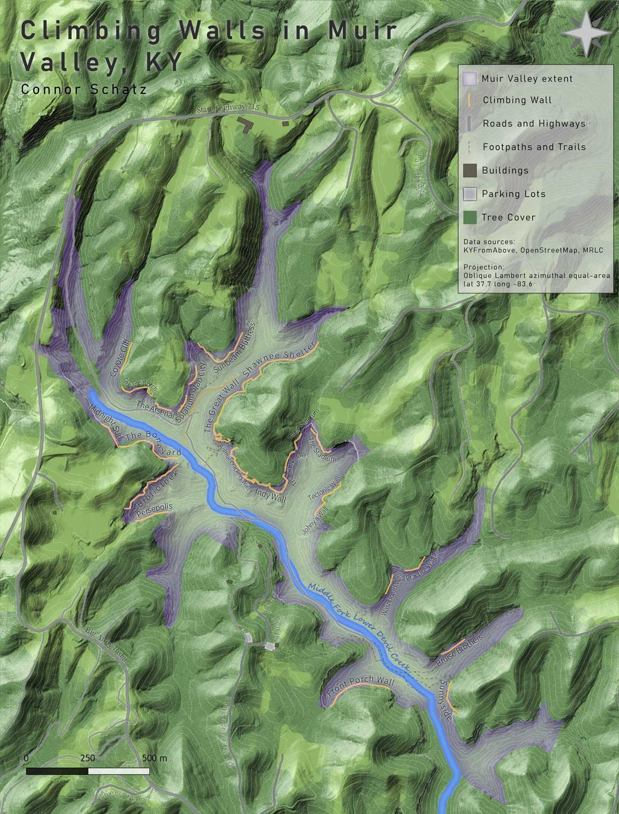
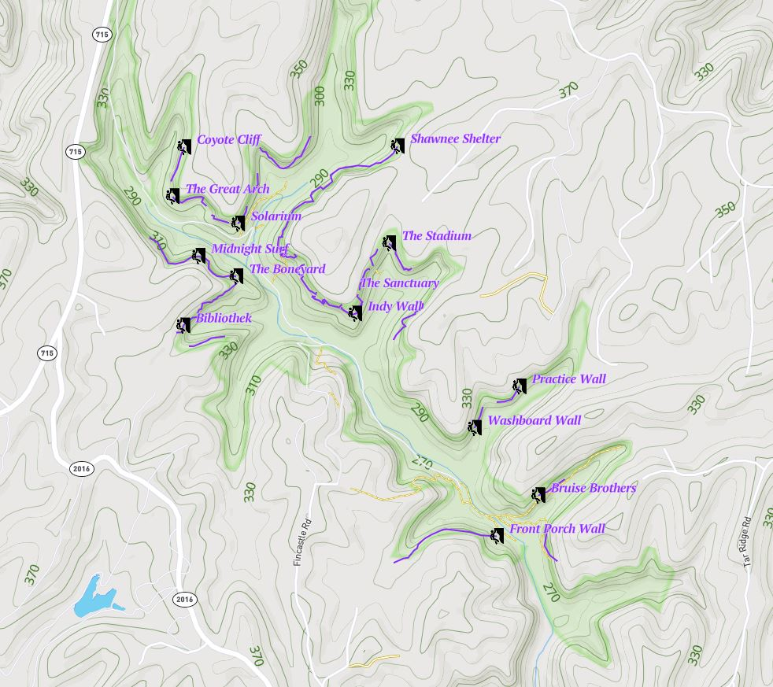
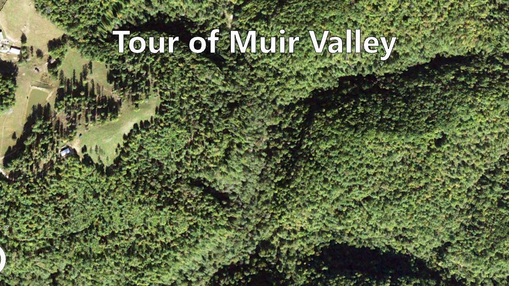
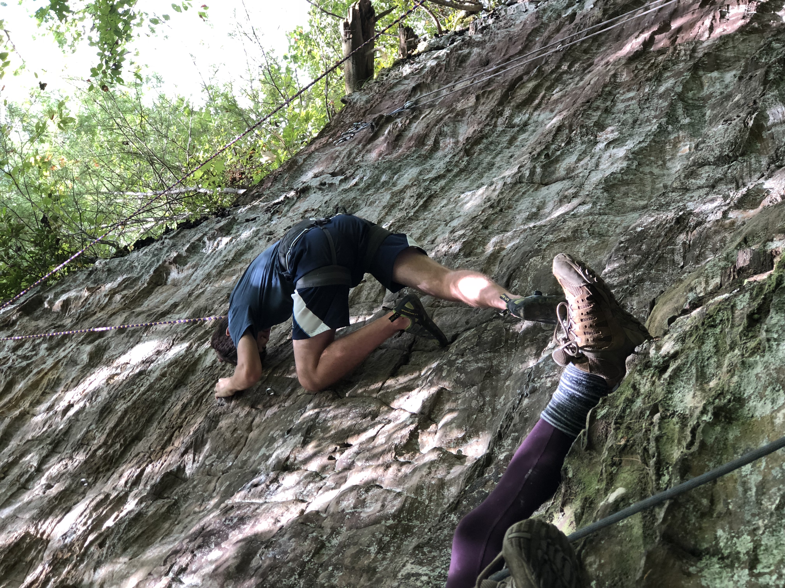

# The Muir Valley

https://wcschatz.github.io/muir

## Introduction

Muir Valley is a privately owned, nonprofit nature reserve and rock climbing destination, south west of Natural Bridge State Park, and features 415 different climbing routes, featuring mainly sport climbs ranging from beginner 5.6s to a very difficult 5.14a according to the Yosimite Decimal System (<a href="https://en.wikipedia.org/wiki/Grade_(climbing)#Free_climbing_2">YDS</a>). This area features many other natural features such as waterfalls, caves and streams which is common for the Red River Gorge area. This project will be looking at the major rock walls in the area, as well as the overall topography of the area. Hopefully these maps will serve as a good way for a new visitor to understand the layout of the valley better.

## Digital Rendering of the Muir Valley Area

*Map of Muir Valley and its climbing walls*

This map shows the overall terrain and surrounding features of Muir Valley, as well at the locations of the climbing walls.

### Interactive Map of Muir Valley's climbing wall locations

*A map of Muir Valley created using Mapbox Studio [Mapbox link](mapbox/index.html)*

Between these 25 rock walls there are over 400 climbing routes, primarily consisting of sport and trad climbs, drawing in a large number of climbers throughout the year.

### Video fly-through of Muir Valley

*Fly-through video through Muir Valley ([Watch video](https://youtu.be/K2IJF6lKVwI))*

This is a 3D render of the valley using LIDAR data, showing elevations and the natural features of the area

## Photographs

*Climbing at Practice Wall*, Photo by Connor Schatz, 2020

     
*Ascentuality, Stadium, Muir Valley*

## Sources and tools

These maps were produced by Connor Schatz, in May 2021, for the Geography 409 final project.

Elevation data was acquired from the Kentucky's Elevation Data & Aerial Photography Program ([KyFromAbove.ky.gov](http://kyfromabove.ky.gov)). 
Color aerial imagery was acquired from the National Agriculture Imagery Program (NAIP) stored on public FTP server maintained by Kentucky Division of Geographic Information ([DGI](https://technology.ky.gov/gis/Pages/default.aspx))
Roads, buildings, and other manmade features were sourced from ([OpenStreetMap](https://www.openstreetmap.org/#map=17/37.72575/-83.63400)).

Various [ArcGIS Pro](https://www.esri.com/en-us/arcgis/products/arcgis-pro/resources) lidar and digital surface model tools were used to process and analyze these data. 
A Python script was developed to automate this process and is found in this [Jupyter Notebook](build-lidar-analysis.ipynb).
